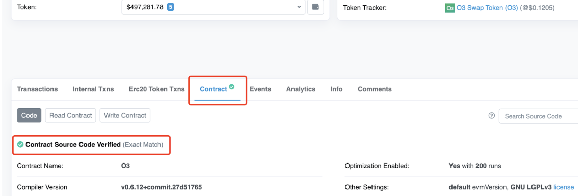

# Summary

Users can map ETH, BTC, stable coins and other assets to Cube through the asset cross-chain bridge, which is achieved by locking a certain number of assets on the source chain and generating the corresponding number of Tokens in Cube.

Cube encourages community developers to provide more decentralized cross-chain solutions.

This document describes the option for project parties to map Tokens from the source chain to Cube on their own.

The project owner maintains the total balance of tokens on the multi-chain including Cube on his own and endorses the credibility of tokens.

The main processes include: 

```
1）Initial Preparation
2）Source Chain -> Cube Chain
3）Cube Chain -> Source Chain
```

## Glossary 

Source Chain: The source chain where the Token is located (e.g. Ethereum)

Src_Token: Token on the source chain, possibly a contract, or a native Token

Locked address or contract: the address used to lock the Token

Cube_Token: Token on Cube's chain
## Initial Preparation

1) Deploy the lock address or contract on the source chain `Src_Lock_Addr`

2) Deploy Token on Cube: `Cube_Token`

3) Deploy a lock address or contract on Cube `Cube_Lock_Addr`

If you need multiple sign contracts, you can refer to [gnosis/safe-contracts](https://github.com/gnosis/safe-contracts) or [gnosis/MultiSigWallet](https://github.com/gnosis/MultiSigWallet).

If you need contracts with mint/burn, you can refer to [OpenZeppelin/openzeppelin-contracts](https://github.com/OpenZeppelin/openzeppelin-contracts/tree/master/) contracts/token/ERC20).

> In order to maintain credibility, the project needs to publicize the above information to the community and invite the community to supervise it. And to monitor the total amount of coins on both chains.

## Source Chain->Cube Chain

1) Source chain locking `Src_Token`

Transfer a certain amount of `Src_Token` to `Src_Lock_Addr` for locking

2) Release `Cube_Token` on the Cube chain

Execute mint operation to give `Cube_Lock_Addr` the corresponding amount of `Cube_Token`

## Cube chain->Source chain

1) Cube chain lock `Cube_Token`

Execute burn operation, destroy `Cube_Token`

2) Release `Src_Token` on the source chain

operation `Src_Lock_Addr` to unlock the corresponding volume


## Helping project  connect to the O3swap cross-chain bridge   
Project Listing

Open-source the token contracts
Make sure the token contract on each chain you want it to be listed is open-sourced as below.  


Choose a plan
Choose an expected integration plan and fill out the Application Form.

Plan 1: Bridge List
- Needs to deploy liquidity pools and requires initial liquidity to enable the cross-chain pools.
- Liquidity incentives will be provided in $O3 for users who add your token liquidity into O3 Interchange.
- Lower fees for users to bridge your token.
- Token listed in the Bridge List will also be added to the Swap List.

Plan 2: Swap List
- Aggregates liquidity from DEXs, thus doesn't require extra liquidity.
- Users pay an extra fee to the DEX when performs cross-chain swap.

Get ready to deploy

Plan 1: 
After the application has been confirmed, the liquidity pool will be scheduled(normally launches on 1th or 15th every month, can also be expedited if negotiated) to be deployed according to the token info submitted in the form.

Plan 2:
If the DEXs filled in the form that having the token trading pairs are confirmed already been aggregated into O3 Swap, then the token can be listed to the Swap list in a shorter time. (then skip to Step 6)
If the DEXs haven’t been aggregated into O3 Swap, we will assess the contracts and plan to aggregate them.

Initial Liquidity

The initial token liquidity (normally requires $200 at least for each chain, while the actual amounts will be informed beforehand) has to be transferred to the receiving address(will be given by our colleague) to initial the pool and enable the bridging function 3-5 days before the launch.

Staking Pool for Liquidity Mining

$O3 Liquidity Mining
When the liquidity pool has been deployed, an LP pool will also be deployed to reward liquidity providers. Each pool will be distributed a pool weight depending on the trading or marketing demand.

$O3 + $PROJECT Dual-Mining (Optional)
If you are going to provide the project’s token as the rewards of liquidity mining, the amount and duration have to be confirmed and transferred to the receiving address(will be given by our colleague) 3-5 days before the launch.
	
Launch & Co-Marketing

When it launches, we will do co-marketing to encourage users to provide your token liquidity, mine, and trade. 
The twitter announcement & retweeting is required to maximize the marketing performance.


> Notes: If you need me, please contact me through the developer community and I will come and help you! [telegram][telegram_link]

  [telegram_link]: https://t.me/CubeDevs