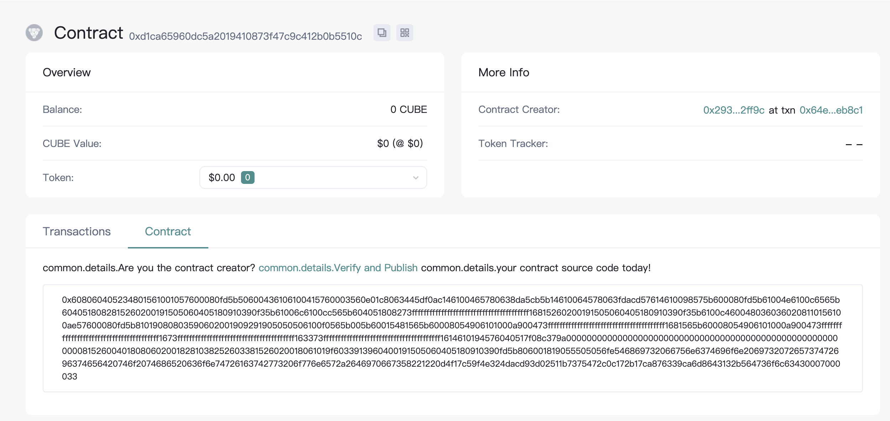
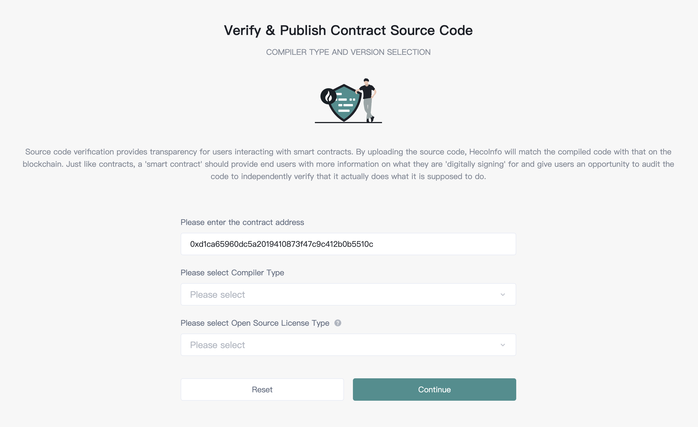
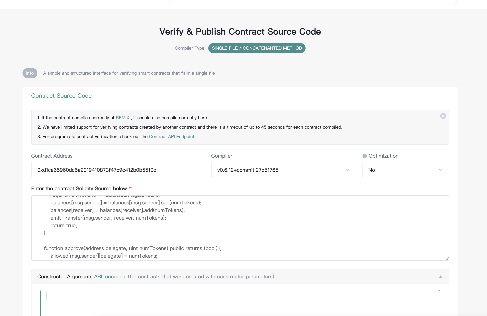

# Contract
`Cube` use `EVM` for contract execution.See [Solidity](https://docs.soliditylang.org/) for detail.

## Remix

[Remix IDE](https://remix.ethereum.org) is an open source web and desktop application. It fosters a fast development cycle and has a rich set of plugins with intuitive GUIs. Remix is used for the entire journey of contract development as well as being a playground for learning and teaching contract development.


Create new file in file explorer. Edit contract info at right side.


Compile contract

1. Click compiler button, switch UI
2. Select contract you want to compile
3. Set compile flags
4. Clieck compile button


Deploy contract to blockchain via wallet such as `MetaMask`.

Step1. Set network info in `Metamask`.


Step2. Back to `Remix`.

+ Swich environment
+ Select contract
+ click deploy button


And then by `MetaMask` the contract deployment transaction can be broadcasted to the Cube chain.


## Truffle
Use truffle to compile and deploy contract.
+ Install Node.js
See [Installing Node.js](https://nodejs.org/en/download/package-manager/) for detail.

+ Install truffle
```
npm install -g truffle
```
Run `truffle version` after installation finished. If the command line displays a message like below, installation is successful.

```javascript
Truffle v5.1.36 (core: 5.1.36)
Solidity v0.5.16 (solc-js)
Node v10.22.1
Web3.js v1.2.1
```
+ Create project

First, create folder for project.
```
mkdir Example
cd Example
```

Then, initialize project via truffle
```
truffle init
```
After initialization is complete, the following file structure is generated within the project.
```javascript
|-- contracts         //folder for contracts
|-- migrations        //folder for deployment scripts
|-- test              //folder for test scripts
|-- truffle-config.js //truffle config file
```
+ Config truffle info

```javascript
const HDWalletProvider = require('@truffle/hdwallet-provider');

const fs = require('fs');
const mnemonic = fs.readFileSync(".secret").toString().trim();

module.exports = {
  networks: {
    testnet: {
      provider: () => new HDWalletProvider(mnemonic, 'https://http-testnet.cube.network'),
      network_id: 1819
    },
    mainnet: {
      provider: () => new HDWalletProvider(mnemonic, 'https://http-mainnet.cube.network'),
      network_id: 1818
    }
  },

  // Set default mocha options here, use special reporters etc.
  mocha: {
    // timeout: 100000
  },

  // Configure your compilers
  compilers: {
    solc: {
      // version: "0.5.1",    // Fetch exact version from solc-bin (default: truffle's version)
      // docker: true,        // Use "0.5.1" you've installed locally with docker (default: false)
      // settings: {          // See the solidity docs for advice about optimization and evmVersion
      //  optimizer: {
      //    enabled: false,
      //    runs: 200
      //  },
      //  evmVersion: "byzantium"
      // }
    },
  },
};

```
+ Create contract

Put custom contracts into folder `contracts` and modify the deployment script script in folder `migrations`.

+ Deploy contract

Run the deployment command.
```
truffle migrate --network testnet
```
The output as below.
```
2_example_migration.js
======================

   Deploying 'ExampleToken'
   ------------------------
   > transaction hash:    0x91e50594a63bc6f4c299f3f445868571678be306b835bddce6dff5c7a5ddf9dc
   > Blocks: 2            Seconds: 4
   > contract address:    0x54D2049715FC8De1361D7350de90eb05F0f6CA84
   > block number:        375304
   > block timestamp:     1608016637
   > account:             0x03D32B774295D740ffEe43b20fcC0a53acC576e6
   > balance:             878.909609236165318643
   > gas used:            1056044 (0x101d2c)
   > gas price:           20 gwei
   > value sent:          0 ETH
   > total cost:          0.02112088 ETH


   > Saving migration to chain.
   > Saving artifacts
   -------------------------------------
   > Total cost:          0.02112088 ETH


Summary
=======
> Total deployments:   1
> Final cost:          0.02112088 ETH
```
Finally, the contract deployment is complete.


## Hardhat


#### Using Hardhat
##### What is Hardhat
Hardhat is a development environment to compile, deploy, test, and debug your smart contract.

##### Setting up the development environment
There are a few technical requirements before we start. Please install the following: Requirements:

##### Installing
There are a few technical requirements before we start. Please install the following: Requirements:

* Windows, Linux or Mac OS X
* Node.js v8.9.4 LTS or later
* Git

First, you need to create an empty project ```npm init --yes```

Once your project is ready, you should run

```solidity
npm install --save-dev hardhat
```
It's recommeded to install some dependencies.

```solidity
npm install --save-dev @nomiclabs/hardhat-waffle ethereum-waffle chai @nomiclabs/hardhat-ethers ethers
```

To use your local installation of Hardhat, you need to use ``npx``` to run it (i.e. ```npx hardhat```).

#### Create A Project
To create your Hardhat project run npx hardhat in your project folder:

```solidity
mkdir CubeCoin
cd CubeCoin
```

* Intialize your project:

```javascript
npx hardhat

888    888                      888 888               888
888    888                      888 888               888
888    888                      888 888               888
8888888888  8888b.  888d888 .d88888 88888b.   8888b.  888888
888    888     "88b 888P"  d88" 888 888 "88b     "88b 888
888    888 .d888888 888    888  888 888  888 .d888888 888
888    888 888  888 888    Y88b 888 888  888 888  888 Y88b.
888    888 "Y888888 888     "Y88888 888  888 "Y888888  "Y888

👷 Welcome to Hardhat v2.9.7 👷‍

? What do you want to do? … 
  Create a basic sample project
  Create an advanced sample project
  Create an advanced sample project that uses TypeScript
❯ Create an empty hardhat.config.js
  Quit

```

Once this project is initialized, you'll now have a project structure with the following items:

* contracts/: Directory for Solidity contracts
* scripts/: Directory for scriptable deployment files
* test/: Directory for test files for testing your application and contracts
* hardhat-config.js: Hardhat configuration file

#### Create Contract

You can write your own smart contract.

#### Config Hardhat for CUBE
* Go to hardhat.config.js
* Update the config with cube-network-crendentials.

```javascript
/**
 * @type import('hardhat/config').HardhatUserConfig
 */
require("@nomiclabs/hardhat-waffle");
require('@nomiclabs/hardhat-ethers');
const fs = require('fs');
const mnemonic = fs.readFileSync(".secret").toString().trim();

// This is a sample Hardhat task. To learn how to create your own go to
// https://hardhat.org/guides/create-task.html
task("accounts", "Prints the list of accounts", async () => {
  const accounts = await ethers.getSigners();

  for (const account of accounts) {
    console.log(account.address);
  }
});

// You need to export an object to set up your config
// Go to https://hardhat.org/config/ to learn more

/**
 * @type import('hardhat/config').HardhatUserConfig
 */
module.exports = {
  defaultNetwork: "mainnet",
  networks: {
    localhost: {
      url: "http://127.0.0.1:8545"
    },
    hardhat: {
    },
    testnet: {
      url: "https://http-testnet.cube.network",
      chainId: 1819,
      gasPrice: 20000000000,
      accounts: {mnemonic: mnemonic}
    },
    mainnet: {
      url: "https://http-mainnet.cube.network",
      chainId: 1818,
      gasPrice: 20000000000,
      accounts: {mnemonic: mnemonic}
    }
  },
  solidity: {
  version: "0.6.12",
  settings: {
    optimizer: {
      enabled: true
    }
   }
  },
  paths: {
    sources: "./contracts",
    tests: "./test",
    cache: "./cache",
    artifacts: "./artifacts"
  },
  mocha: {
    timeout: 20000
  }
};

```


!!! Note It requires mnemonic to be passed in for Provider, this is the seed phrase for the account you'd like to deploy from. Create a new .secret file in root directory and enter your 12 word mnemonic seed phrase to get started. To get the seedwords from metamask wallet you can go to Metamask Settings, then from the menu choose Security and Privacy where you will see a button that says reveal seed words.

#### Compile Contract
To compile a Hardhat project, change to the root of the directory where the project is located and then type the following into a terminal:
```solidity
npx hardhat compile
```

#### Deploying on CUBE Network
Run this command in root of the project directory:
```solidity
$  npx hardhat run --network testnet scripts/deploy.js
```
>Remember your address, transaction_hash and other details provided would differ, Above is just to provide an idea of structure.

**Congratulations!** You have successfully deployed CRC20 Smart Contract. Now you can interact with the Smart Contract.

You can check the deployment status here:  https://testnet.cubescan.network/en-us/ or https://www.cubescan.network/en-us/


## Smart Contract Verification

**<u>note: Currently supports browser verify contracts for the time being, Plug-in verification will be supported later**</u>


#### How to Verify Your Contract on CubeScan

Step 1: Deploy your contract on Cube Chain

[deploy contract](contract.md)

Step 2: Go to Cube Explorer or Testnet Explorer



Click on "Verify and Publish"



* Contract Address
* Compiler Type you chose in Remix or other complier
* Select Open Source License Type

Step 3: Fill in the correct information of your contract



You need to select "Yes" for Optimization, if that's enabled.

Contructor arguement is optional. If your contract do have one, you can go to this page to generate the encoded ABI json.

!!! info

Click on **"Verify and Publish"** to finish this process. Now you are all set!

