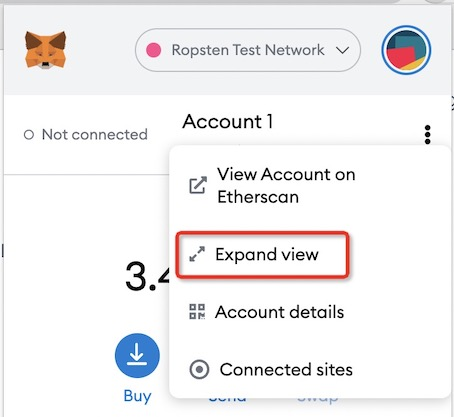

# Full Ethereum Protocol Compatibility

Cube believes that Ethereum is the industry standard for blockchain applications development. To attract more high-quality Dapps projects and developers to join the Cube
ecosystem, Cube has implemented the full Ethereum protocol in the settlement layer.
The virtual machine Cube is not only fully compatible with EVM, but also keeps
up with the latest EIP’s so that developers can directly deploy the existing Dapps on
Ethereum to Cube. All the development tools developed on Ethereum, including Wallet,
Solidity, Remix, Truffle and Hathat, can also be directly used on the Cube Chain.
Cube is also compatible with almost all of the RPC interfaces of Ethereum, so developers
can switch to Cube’s application development at no cost and get the rewards for Cube’s
ecosystem development.

# Gas Price

The current gas price of cube main network is **200Gwei**, the gas price of test network is 2.5Gwei, the default of metamask main network is 2.5Gwei, if you use remix deployment, you need to adjust the gas price manually, if you use hardhat deployment, you can configure it in hardhat.config.js configuration file to adjust the gas price to 200Gwei

# Metamask Lagging 

Slow response when inputting tansfer amount, fetching gasprice, etc. It is a chrome's known issue according to the following issue:

<https://github.com/MetaMask/metamask-extension/issues/10202>

Workarounds are:

1）Use expand view

2）Move to primary monitor if using multiple monitors

3）Use other explorers

# Transaction pending for a long time

## 1）Inappropriate nonce:
Suggestions:

- Try to reset a appropriate value
- If you have many pending transactions, please wait for Earlier Are confirmed.
- metatask--setting-advanced--reset account
- metatask--setting--advanced--Customize transaction nonce: resend transaction with pending tx's nonce and higher gas price.

## 2) Low gas price: 
- Set a higher gas price and resend

#  Synchronization node and the validator node

currently can not apply for verification node, and will be open for application after a while, now synchronized are synchronized node, upgrade to verification node need to wait for the official notification, I believe, soon

# Dapp tool contract

Mainnet：

* WCUBE Address：0x9d3f61338d6eb394e378d28c1fd17d5909ac6591
* Multicall Address: 0x28d2ebdb36369db1c51355cdc0898754d1a1c3c5
* Multicall2 Address: 0x511b6bdf973bccda108059f082807bc5f2ef6b8b

Testnet

* WCUBE Address：0xb9164670a2f388d835b868b3d0d441fa1be5bb00
* Multicall Address: 0x5db2ab28bed8ebdde5f7202f5a11ff7e78ad1fb5
* Multicall2 Address: 0xd1c09d6dd5c81d441b2825d69d438baac791beec

# Developer Telegram Community 

Developer telegram : <https://t.me/CubeDevs>  
Developer discord: <https://discord.gg/cubenetwork>

# Which wallets currently support cube chain？

Metamask,Bitkeep, Coinhub, Itoken, Coinbase, Walletnow, Ledger，they are ok。

# Where can we buy cube coin?

You can buy it on Huobi Global.

# PriceOracle

chainlink will be supported soon, those who are in a hurry and need the price of the prophecy machine can use the price of dex ([Capricorn twap][capricorn])

 [capricorn]:https://docs.capricorn.finance/dev/docs/twap-oracle

