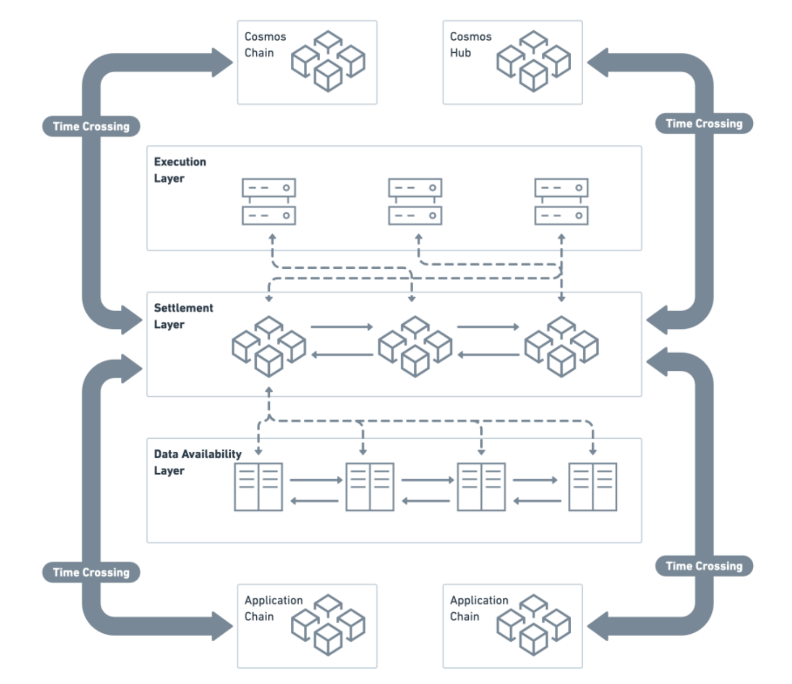

# Cube Chain

## Introduction to Cube Chain
Cube Chain is a high-performance, modular Layer 1 blockchain that is compatible with the EVM and Cosmos ecosystem. Cube supports a multi-chain and interoperable future through its multi-chain framework and Web 3.0 infrastructure. 

## Cube’s Value Propositions 
To help developers’ evolvement at every stage 

1. Designed with modular architecture for breaking through the Blockchain Trilemma of Decentralization, Scalability, and Security. 
2. Tokenomics is designed to reward individual contributions to network. 
3. High-performance with low gas fees. 
4. Localized infrastructure for geographic strategic partners. 
5. Upgraded development experience with Golang and Solidity.

## Technical Features 

1. Modular layered architecture (divided in three layers: Execution Layer, Settlement Layer and Data Availability Layer), built-in Rollup and extreme scaling, supporting hundreds of thousands of TPS. 
2. Full compatibility with Ethereum protocols, EVM and Cosmos ecosystem, supporting a seamless migration of applications within the ecosystem. 
3. Pipelined optimized BFT consensus, combining high throughput, decentralization, security and fast transaction confirmation. 
4. Support DeFi cross-chain calls, multi-chain network structure with own-developed “Time Crossing” decentralized  cross-chain communication protocol.

## Cube Roadmap

<table >
    <tr style="background:rgba(0,0,0,0)" ><th colspan=5>Cube Technical Route</th> </tr>
    <tr style="background:rgba(0,0,0,0)" >
<th > Stage </th><th> Features </th><th> Time </th><th> Sub Stage </th><th> Technical Points </th>
</tr>
<tr style="background:rgba(0,0,0,0)" >
<tr style="background:rgba(0,0,0,0)" >
    <td rowspan=6 >One</td>
    <td rowspan=6 >
Chaos Consensus v1.0</td>
    <td rowspan=6 >2022 Q1-2022 Q2</td>
    <td rowspan=3 >Public Beta</td><td>Higher transaction performance</td></tr>
<tr style="background:rgba(0,0,0,0)" ><td>Lower transaction costs</td></tr>
<tr style="background:rgba(0,0,0,0)"><td>Fast finality</td></tr>
<tr style="background:rgba(0,0,0,0)"> <td rowspan=3 >Node Election</td><td>Increased decentralization and security</td></tr>
<tr style="background:rgba(0,0,0,0)"><td>Complete mainstream assets</td></tr>
<tr style="background:rgba(0,0,0,0)"><td>Basic tools in place</td></tr>

<tr style="background:rgba(0,0,0,0)"><td rowspan=4 > Two </td><td rowspan=4 > 
Chaos v2.0  </td> <td rowspan=4 >2022 Q3 </td> <td rowspan=4 > To be announced  </td> <td> Reach 5000 TPS </td></tr>
<tr style="background:rgba(0,0,0,0)"><td> DPoS + random selection </td></tr>
<tr style="background:rgba(0,0,0,0)"><td> Streamline Consensus </td></tr>
<tr style="background:rgba(0,0,0,0)"><td>Pipelined processing</td></tr>

<tr style="background:rgba(0,0,0,0)"><td rowspan=3> Three </td> <td rowspan=3>
Time-crossing cross chain protocol
</td><td rowspan=3>2022 Q4</td><td rowspan=3>To be announced</td><td>Multi-chain structure</td></tr>
<tr style="background:rgba(0,0,0,0)"><td>Cross Channel: Cross-chain contract calls</td></tr>
<tr style="background:rgba(0,0,0,0)"><td>IBC Compatibility</td></tr>
<tr style="background:rgba(0,0,0,0)"><td rowspan=3> Four </td> <td rowspan=3>
Settlement Layer & Execution Layer structure
</td> <td rowspan=3>2023 Q2</td> <td rowspan=3>To be announced</td><td>built-in Collaborative rollup</td></tr>
<tr style="background:rgba(0,0,0,0)"><td>built-in zkRollup(if zkEVM is ready)</td></tr>
<tr style="background:rgba(0,0,0,0)"><td>extreme scaling</td></tr>

<tr style="background:rgba(0,0,0,0)"><td rowspan=4> Five </td> <td rowspan=4>
Data Availability 
</td> <td rowspan=4>2024</td> <td rowspan=4>To be announced</td><td>Data availability sampling</td></tr>
<tr style="background:rgba(0,0,0,0)"><td>Data sharding</td></tr>
<tr style="background:rgba(0,0,0,0)"><td>Proof of Fraud</td></tr>
<tr style="background:rgba(0,0,0,0)"><td>50k+ TPS</td></tr>
</table>

## Vision & Architecture

Cube is a public blockchain that is designed to collaborate and promote the development of the industry, taking into account the current needs of decentralized applications and the future innovation and development. It takes high-performance underlying permissionless blockchain as a new starting point, realizes the ultimate performance optimization of single-chains in phases, supports and promotes the development of Web 3.0 in modular layers, solves storage pain points, forming a permissionless blockchain with complete underlying capabilities that everyone can participate in.

#### Architecture

Cube adopts a modular architecture which is divided into three layers: Execution Layer, Settlement Layer and Data Availability Layer.

• Execution Layer: responsible for the execution of almost all contract-based transactions and supports decentralized applications. It is the combination of ZK Rollup and Collaborative Rollup, where the execution results are submitted to the settlement layer and the settlement layer establishes undeniable security as well as objective finality.  

• Settlement layer: responsible for verifying and settling the execution results of the execution layer and is also the asset layer, responsible for the management and settlement of the assets on the chain.  

• Data availability layer: focusing on data storage, it will store permanently high-value data based on data sharding, and with data availability sampling technologies it can support reliable verification for light clients.  

[Read the technical-white paper for more information][cube-information]
 
 [cube-information]:https://github.com/cube-network/techical-whitepaper

## Interact with us on Social Media

- Website: <https://cube.network>  
- Twitter: <https://twitter.com/Cube0x>  
- Medium: <https://medium.com/@Cube0x>  
- Telegram 1: <https://t.me/Cube_Network>  
- Telegram 2: <https://t.me/Cube_network2>  
- Telegram 3: <https://t.me/cube_network3>  
- Telegram 4: <https://t.me/cube_network04>  
- Developer-Telegram : <https://t.me/CubeDevs>  
- Discord: <https://discord.gg/cubenetwork>  
- GitHub: <https://github.com/cube-network/>  
- Mainnet Explorer: <https://cubescan.network/>  
- Documentation: <https://docs.cube.network/>  
  

## Risk Warning
- All users and developers can participate in the current test environment and subsequent stages of Cube for free.
- All users must distinguish the Testnet environment from the Mainnet. The assets generated in the test environment Have no monetary value. Be aware of counterfeit currency fraud.
- Cube announces authorization, promotion and other collaborations only through the official social media platform. Developers and users should check carefully to avoid losses.
- Do not misread the official website (cube.network), be careful about scams or private key phishing.
