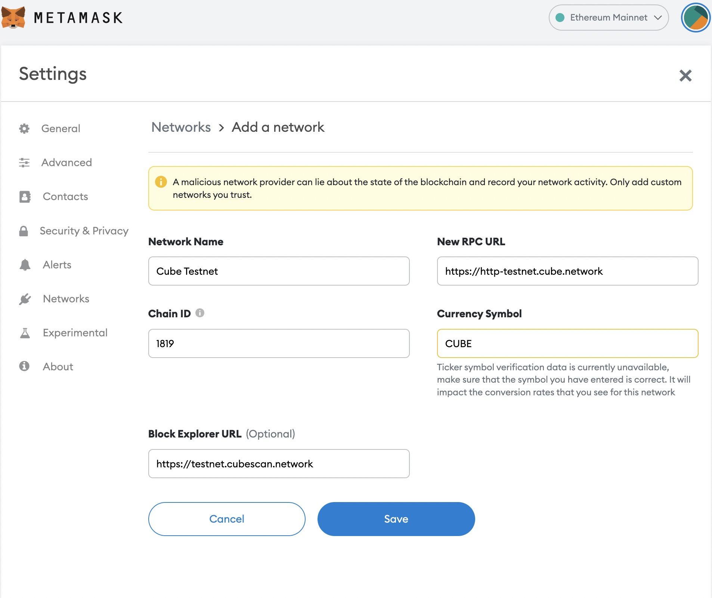
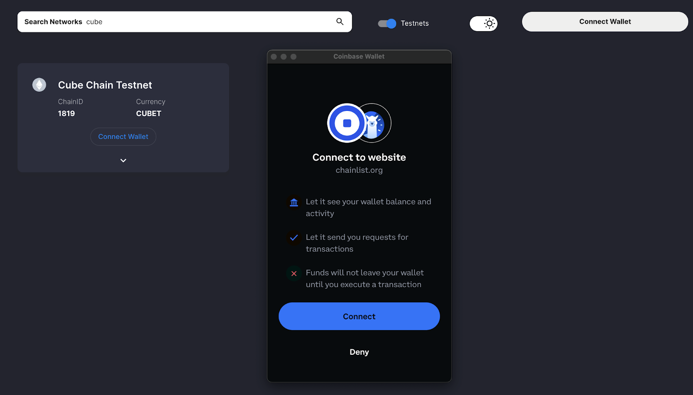

# Summary

Many wallets support CubeChain, such as Metamask, Coinbase wallet, Ledger etc.

> NOTE: Check compitibility before using wallet.

# Metamask

Download URL: https://metamask.io/

You can add CubeChain mainnet and testnet to Metamask through [chainlist](https://chainlist.org/).

add custom network manually:

## Mainnet

### chainid
```
1818
```
### rpc

```
https://http-mainnet.cube.network

https://http-mainnet-sg.cube.network 

https://http-mainnet-us.cube.network
```

### explorer
```
https://www.cubescan.network
```


## Testnet

### chainid
```
1819
```
### rpc
> There will be a rate limit. Currently is 50r/s per session/IP .

```
https://http-testnet.cube.network
https://http-testnet-sg.cube.network
https://http-testnet-jp.cube.network
https://http-testnet-us.cube.network
```
### explorer
```
https://testnet.cubescan.network
```




# Coinbase Wallet

CubeChain EVM fully supports [Coinbase Wallet](https://www.coinbase.com/wallet), a leading wallet for Ethereum based blockchains. In order to interact with the CubeChain using Coinbase Wallet, you need to add the CubeChain network.

The most convenient way to do this is via [Chainlist](https://chainlist.org/), which curates a list of EVM networks. The CubeChain EVM mainnet and testnet are listed on Chainlist with ChainID 1818 and 1819, respectively. To add a chain to Coinbase Wallet, make sure the [Chrome browser extension](https://www.coinbase.com/wallet/getting-started-extension) is enabled. Search “Cube” and press the “Connect Wallet” button, then "Connect". Confirm the connection if prompted. 

Now you are set up and ready to deposit, withdraw or send CUBE!


If you want to add the networks manually, you can find rpc and explorer infomation showing in the `MetaMask` section, or from [Mainnet info](mainnet.md) and [Testnet info](testnet.md)

# Ledger

This tutorial describes how to access your Ledger Cube (CUBE) account via MetaMask.

### Before you start

Make sure to update Ledger Live to the latest version via [this link][link].
Open Ledger Live and connect your Ledger device to the Manager to ensure that your Ledger device is running the latest firmware version.
Ensure that the latest version of the [Ethereum (ETH) app][app] is installed on your Ledger device.
Once you're all done, close Ledger Live as it can conflict with Metamask.

 [link]:https://www.ledger.com/ledger-live/download
 [app]:https://support.ledger.com/hc/en-us/articles/360009576554-Ethereum-ETH-?docs=true

### Can I use the Cube (CUBE) app instead of the Ethereum (ETH) app?

* The Cube (CUBE) app is an experimental feature that is still pending review by the Ledger team.
* Using the app is safe but you might encounter some minor UI bugs.
* Once such a bug prevented Metamask from completing transactions created with the Ledger Cube (CUBE) app.
* A fix will be deployed as soon as possible, in the meantime please use the Ethereum (ETH) app with Metamask.

### Accessing your Ledger Cube (CUBE) account via MetaMask.
Download and install the [MetaMask extension][mask] in your browser by following [these steps][steps].
Open MetaMask and create a standalone MetaMask account as shown in [this video][video].
 In the next steps, you will add a second account to MetaMask: your Cube account.
Once you're all set up, open MetaMask in your browser, click on the three dots icon, and select Expand view.
MetaMask opens in a tab that is easier to navigate.
Connect Metamask to the Cube mainnet by following [these steps][these_steps].

Use the RPC data below to add Cube mainnet to Metamask:
```javascript
Network Name: Cube Mainnet
New RPC URL: https://http-mainnet.cube.network
Chain ID: 1818
Currency Symbol: CUBE
Block Explorer URL: https://www.cubescan.network
```

 [mask]:https://metamask.io/download/
 [steps]:https://metamask.zendesk.com/hc/en-us/articles/360015489531-Getting-started-with-MetaMask
 [video]:https://www.youtube.com/watch?t=32&v=Af_lQ1zUnoM&feature=youtu.be
 [these_steps]:https://docs.cube.network/#/

Metamask now displays an CUBE balance instead of an ETH balance.
Plug your Ledger device into your computer and open the Ethereum app on your device by navigating to the Ethereum icon and pressing both buttons simultaneously.
Your Ledger device displays Application is ready.
In MetaMask, click the round colored icon, select Connect Hardware Wallet > Ledger, and click Continue.
After a brief moment, a list of account addresses appears.
Select an account by ticking the box. Then click Unlock.
Your Cube (CUBE) account and CUBE balance appear in MetaMask.

[metamask + ledger for CUBE of video][cube]

 [cube]:https://www.youtube.com/watch?v=jt7uReKce3E

# Coint type for Cube

https://github.com/satoshilabs/slips/blob/master/slip-0044.md